# SQL-Challenge

## Database schema

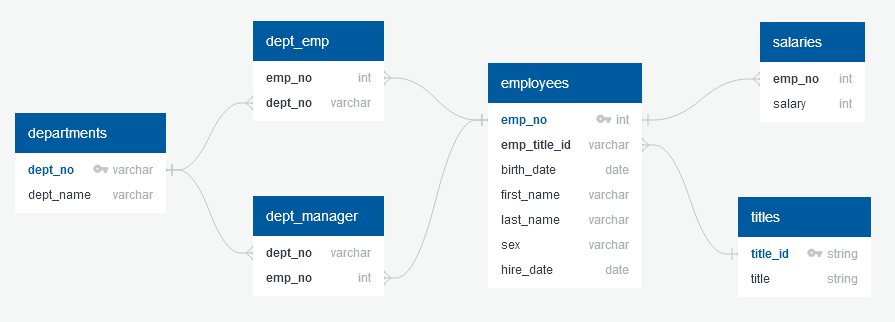

The challenging part of this assignment comes from setting up the correct
relationships between each table. In order to accomplish this, I created an ERD
using [Quick DBD](http://www.quickdatabasediagrams.com).

The schema displayed by the ERD is as follows:

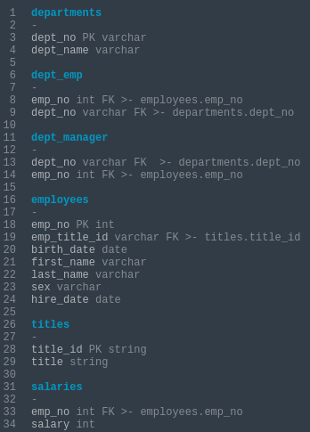

I first identified which tables held primary information. What this means is
that I would look for information where we would expect uniquely defined values
that could not be null values. In the cases of departments, employees, salaries,
and titles, they each held unique values. Because those unique columns were
referenced in other tables, those referenced values became the foreign keys.

When it came to determining the relationships between these foreign keys and
their referenced primary keys, they all followed a many-to-one relationship.
For example, it is possible for there to be many department numbers that are the
same in the dept_emp table, but they all reference back to one department number
in the departments table.

Dept_emp and dept_manager are both junction tables, only holding information
already created in other tables, but held in their own tables to create
associations between them.

## Creating the tables

Once the ERD was set up, it was fairly quick to translate the schema into SQL.
Creating the employees table, for example, looked like this:

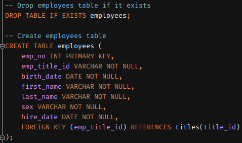

First I dropped the employees table if it already existed (in case I was
re-running the query). Following that, I created the columns that were already
present in the CSV file that held all of the associated information. Following
the schema, I assigned emp_no as the primary key (keeping the datatype that was
in the CSV) and assigned emp_title_id as a foreign key that references the
title_id from the titles table. Everywhere that was not the primary key was
given "NOT NULL" in order to prevent missing data from being imported into the
table, thereby preserving the table's integrity (primary keys by definition
cannot have null values).

I repeated these steps in creating the other tables in preparation for importing
the data from the CSV files.

## Importing the data

Using pgAdmin 4, I imported the CSVs into their respective tables. One concern I
had with importing was with importing the birth and hire dates of each employee
in the employees table. I defined those columns to require a DATE datatype,
which are formatted as YYYY-MM-DD (ISO 8601). However, the dates in the CSVs
were formatted as MM/DD/YYYY, which had me concerned. Thankfully, pgAdmin
automatically converted those date values appropriately without needing to
convert.

That said, I normally use JetBrains's DataGrip to work on SQL projects. To test
if this sort of date conversion is universal when importing data, I decided to
recreate my database using DataGrip, which resulted in the following errors:

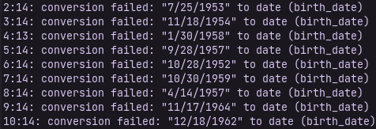

This shows that while pgAdmin will definitely convert the data as best as it can
to match the datatype defined in the table columns, that sort of function is not
universal across all database management tools. I'd be curious to see if this
import is possible in DBeaver, another popular database management tool.

## BONUS: Analysis

### Dependencies and database connection

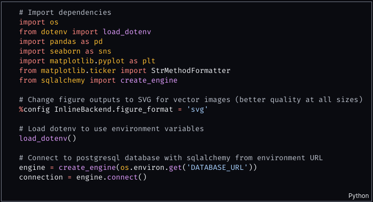

Using Miguel Grinberg's method of adding 
[secret config files to the environment](https://youtu.be/2uaTPmNvH0I?t=998),
I loaded my database URL through a .env file. I also wanted to try learning
Seaborn, another data visualization tool built on top of Matplotlib. I also
imported a formatter function from the Matplotlib ticker module for formatting
the axes on my plots.

Using Matplotlib magic, I also configured the displayed figures to be in an SVG
format, rather than the default PNG. I find that the vector-based images are
sharper at all dimensions while keeping the file sizes small.

I then initialized the engine and connection objects with my environment
DATABASE_URL variable.

### Salary query and histogram

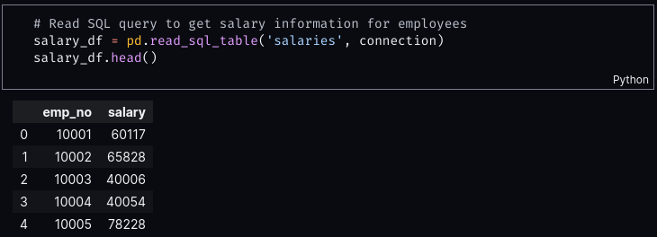

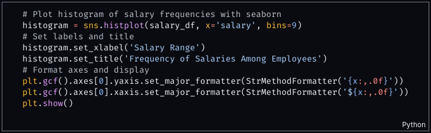

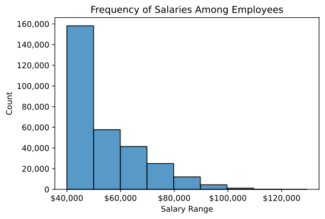

I used Pandas's read_sql_table function to get the entirety of the salaries
table from the database and store that into a dataframe. Using that dataframe,
I then used seaborn's histplot function, defining the salary as my x-axis, and
it automatically found the counts of the ranges as defined by my bin size. I
then formatted my axes using Matplotlib.

### Title query and bar chart

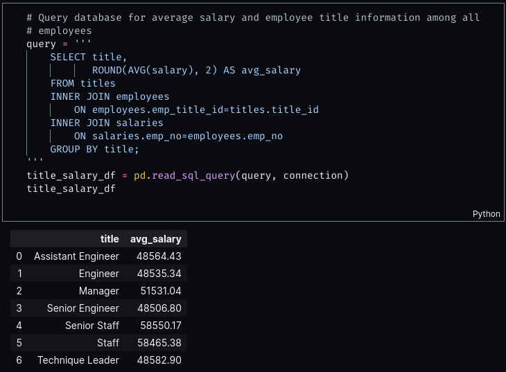

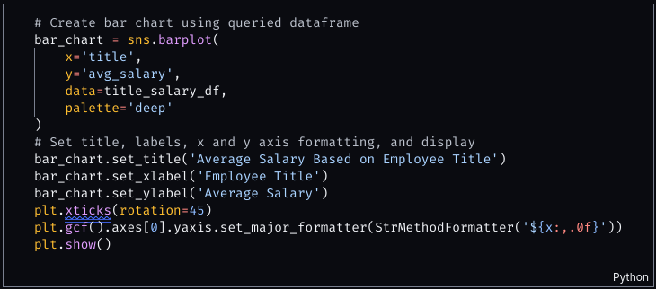

To be able to get salaries associated with their titles, I had to find the
name of the titles attached to the title_id of each employee, and then attach
each employee's salary to the employee themselves. Doing these through JOINs
enabled me to group each employee by their titles, and then find use the AVG
aggregate function to find the average salary of all employees grouped under
each title. Lastly, I formatted the axes appropriately (and tried a new color
palette offered by Seaborn).

### Conclusion based on the data

First off, unless this company is a Fortune 100 company, I highly doubt there
are 300,000 employees employed by this company. However, the strongest evidence
that the data is fake comes from the fact that the salary based on the employee
titles don't make much sense. For example, how does a senior engineer make as
much money as an assistant engineer-

*"Search your ID number." You look down at your badge to see that your employee
ID number is 499942.*

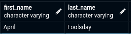

Oh.
